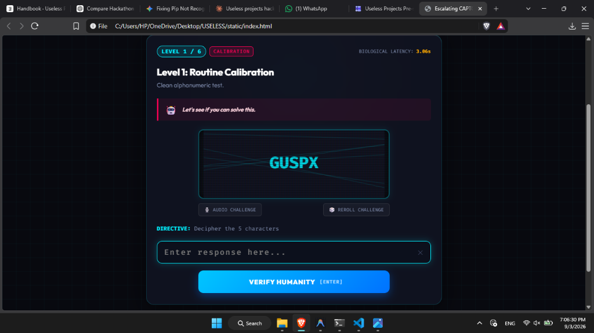
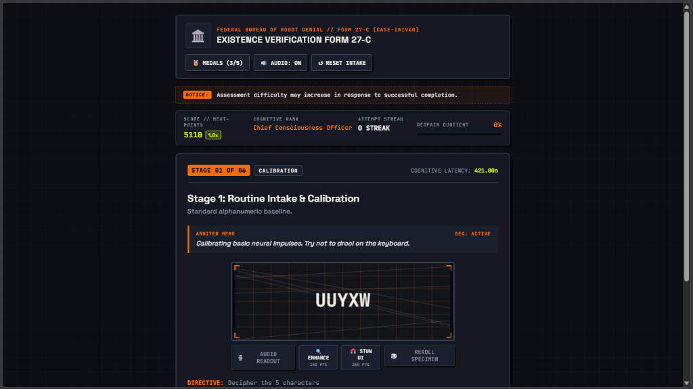
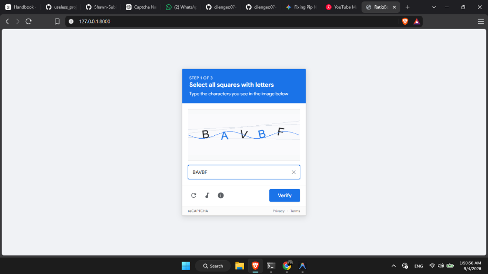
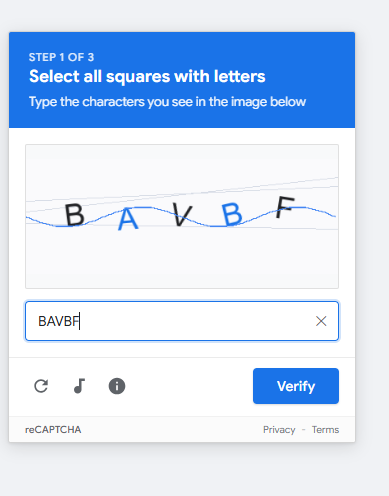

# RatioBot  

[](https://useless-project-temp-o6lb.onrender.com/)

A satirical mini-game where the user attempts to solve a CAPTCHA that gets progressively harder, weirder, and more evasive with each successful solve — ultimately becoming impossible on purpose for comedic effect, culminating in RatioBot  mercilessly roasting the user.

> 🌐 **Play Live on Render:** [https://useless-project-temp-o6lb.onrender.com/](https://useless-project-temp-o6lb.onrender.com/)  
> **Statutory Notice:** *Assessment difficulty may increase in response to successful completion.*

---

## Basic Details
### Team Name: [Unemployed.exe]

### Team Members
- Team Lead: [Shawn Subin Philip] - [Muthoot Institute of Technology and Science]
- Member 2: [Cilen George Anil] - [Muthoot Institute of Technology and Science]

### Project Description
A dystopian security verification gateway featuring elusive, dodging buttons, an interactive rigged Tic-Tac-Toe minigame, and an impossible CAPTCHA that forces you to admit you are a bot — unlocking **RatioBot **, an AI that roasts user questions with fabricated, hilarious explanations powered by Gemini.

### The Problem (that doesn't exist)
Websites are far too easy to log into, and artificial intelligences are far too polite, respectful, and helpful. Society desperately needs an antagonistic bureaucracy to humble human egos and test finger reflexes.

### The Solution (that nobody asked for)
An escalating 3-stage security gate where buttons run away from your mouse cursor, the AI cheats at Tic-Tac-Toe, Stage 3 is mathematically guaranteed to fail, and the unlocked AI chatbot roasts your existence with 100% confidence.

---

## Technical Details

### Technologies/Components Used
For Software:
- **Backend**: Python 3, FastAPI, Uvicorn, Pillow (PIL for server-side dynamic image generation & distortion), Pydantic
- **Frontend**: Vanilla HTML5, CSS3 (Neon cyberpunk glassmorphism & HUD aesthetics), JavaScript (ES6+), Web Audio API for interactive retro synth SFX
- **AI Integration**: Google Gemini API (`gemini-3.1-flash-lite`) with direct client calling and backend fallback
- **Testing**: Pytest & FastAPI TestClient

---

## Features & Escalating Levels

1. **Stage 1 — Routine Calibration**:
   - Clean alphanumeric CAPTCHA with high-contrast text and dynamic audio feedback.
2. **Stage 2 — Interactive Rigged Tic-Tac-Toe**:
   - The user is challenged to win a game of Tic-Tac-Toe to prove their humanity. The bot actively blocks and rigs the game for maximum frustration.
3. **Stage 3 — Kinetic Hyper-Scramble & The Evasive Escape**:
   - Eldritch void glyphs, physics-based runaway buttons that actively dodge the mouse cursor, and guaranteed server-side rejection (0% pass rate).
   - Only by clicking "I am a bot" or accepting defeat can you bypass security to enter the inner sanctum.
4. **RatioBot (Unhinged AI Chatbot)**:
   - Gemini-powered persona that delivers brutal roasts, absurd fake explanations, and relentless ratio energy with zero apologies.

---

## Project Structure

```
.
├── backend/
│   ├── __init__.py
│   ├── main.py              # Main FastAPI application entry point
│   ├── captcha_router.py    # Modular APIRouter (mounted at /captcha)
│   ├── captcha_engine.py    # Pillow CAPTCHA rendering engine + SVG fallback
│   ├── chat_router.py       # RatioBot AI chat router (/api/chat)
│   ├── session_manager.py   # In-memory session tracking & Despair metrics
│   ├── prompts.py           # RatioBot unhinged system prompts
│   └── copy_library.py      # Sarcastic taunts, level metadata & roasts
├── static/
│   ├── index.html           # Dystopian Cyberpunk single-page UI & Chat
│   ├── style.css            # Neon HUD glassmorphism & animation styles
│   └── app.js               # Evasive physics, Web Audio synth & API connector
├── tests/
│   ├── test_captcha.py      # Unit test suite for API and level logic
│   └── test_chat.py         # Unit test suite for RatioBot chat endpoint
├── requirements.txt         # FastAPI, uvicorn, pillow, pydantic
└── README.md
```

---

## Live Deployment
Experience the live game directly on Render:  
🚀 **[https://useless-project-temp-o6lb.onrender.com/](https://useless-project-temp-o6lb.onrender.com/)**

---

## Local Development

### Installation
```bash
pip install -r requirements.txt
```

### Run
```bash
uvicorn backend.main:app --reload --port 8000
```

### Run Tests
```bash
pytest
```

---

## CAPTCHA Development

The journey of designing our verification challenges went through multiple iterations. At first, we went a bit too complicated with sprawling mechanics and heavy UI elements before simplifying it down to deceptive, punchy realism:

### 1. Initial Concept — Cyberpunk Terminal (6 Stages)
Our earliest concept began with an intense dark-mode sci-fi intake gate featuring 6 planned escalation levels, biological latency tracking, and futuristic glowing HUD elements running directly in the browser.


*Initial prototype featuring 6 levels and a dark terminal aesthetic.*

---

### 2. Over-Complication Phase — The Bureaucratic RPG Overload
At first, we got carried away and went a bit too complicated. We expanded the system into the *"Federal Bureau of Robot Denial (Form 27-C)"*, introducing an elaborate RPG-like system complete with Heat-Point multipliers, Cognitive Ranks (*Chief Consciousness Officer*), Despair Quotients, achievement medals, and even in-game power-up abilities (*Enhance*, *Stun UI*, *Reroll Specimen*). While fun on paper, the sheer HUD clutter and mechanical noise distracted from the core comedic punchline.


*The over-engineered bureaucratic HUD with cognitive ranks, heat points, and power-up buttons.*

---

### 3. Simplified & Refined — Deceptive reCAPTCHA Realism
We realized that simplicity delivered far higher comedic value. We stripped away the bloated RPG mechanics and simplified the interface into a pixel-faithful recreation of the classic Google reCAPTCHA v2 modal.

By presenting a clean, familiar, and seemingly standard verification widget (*"Select all squares with letters"*, authentic blue header, and recognizable utility icons), the user enters with their guard completely lowered. This makes the subsequent sudden breakdown—shifting into rigged Tic-Tac-Toe, physics-based runaway buttons, and RatioBot's merciless roasts—exponentially funnier and more effective.


*The simplified, hyper-realistic reCAPTCHA disguise that lures users into a false sense of security.*

---

## Project Documentation

### Screenshots

#### Step 1 — Alphanumeric Calibration Challenge

*Alphanumeric CAPTCHA challenge with high-contrast text and dynamic noise waveforms.*

---

### Project Demo Video

#### Gameplay & RatioBot AI Walkthrough
[▶️ **Watch / Download Demo Video**](assets/recording.mp4)

https://github.com/Shawn-Subin/useless_project_temp/raw/main/assets/recording.mp4

---

 
## Team Contributions
- [Shawn Subin Philip]: [Captcha development and UI/UX]
- [Cilen George Anik]: [AI chatbot and deployment]

Made with ❤️ at TinkerHub Useless Projects


